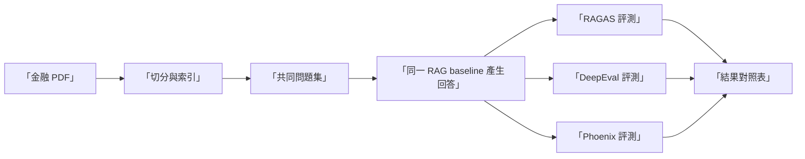

# 金融文件 RAG 橫向比較（RAGAS vs DeepEval vs Phoenix）

> 目標：讓新人用同一份資料、同一組問題、同一個 baseline，直接比較三套工具的定位能力。

## 共用資料與範圍

- 金融文件：Federal Reserve Financial Stability Report (Nov 2021)
- PDF：`/Benchmark-Governance/data/financial-stability-report-20211108.pdf`
- 問題集：`/Benchmark-Governance/data/finance-rag-benchmark.json`

## 共用實驗原則（確保可比較）

1. 三套工具使用同一份問題集。
2. 三套工具使用同一個 RAG baseline 回答。
3. 評審模型版本固定。
4. 每輪輸出保留完整失敗案例。

## 共用流程

## 三工具定位差異

| 面向 | RAGAS | DeepEval | Phoenix |
|---|---|---|---|
| 核心強項 | RAG 專用維度拆解 | 測試工程化與回歸治理 | 可觀測性與評測整合 |
| 最適合問題 | 檢索 vs 生成責任歸因 | 發版前品質準入 | 線上根因定位與趨勢追蹤 |
| 團隊落地方式 | 指標驅動優化迭代 | 測試驅動開發流程 | 監控驅動的持續改善 |

## 新人操作建議順序

1. 先跑 RAGAS：快速理解 RAG 失敗型態。
2. 再跑 DeepEval：把驗收規則變成回歸測試。
3. 最後跑 Phoenix：把線上觀測與離線評測連接。

## 你應該產出的比較結果

每輪建議最少有三份輸出：

1. 每題分數明細（含失敗原因）。
2. 指標聚合摘要（平均、P50、P90）。
3. 低分案例修正清單（分檢索面與生成面）。

## 深度評測建議（金融場景）

1. 事實忠實度：避免超出來源文本推論。
2. 風險敘述保守性：避免過度確定語氣。
3. 引用可追溯性：回答能對回檢索片段。
4. 長文摘要一致性：多段落摘要前後不矛盾。

## 對應 Notebook

- RAGAS：`/Benchmark-Governance/notebooks/ragas-tutorial.ipynb`
- DeepEval：`/Benchmark-Governance/notebooks/deepeval-tutorial.ipynb`
- Phoenix：`/Benchmark-Governance/notebooks/arize-phoenix-tutorial.ipynb`

## 成功標準

當三套工具都指向同一批低品質案例、且修正後三者分數同步提升，代表你的評測體系已具備穩定可用的治理能力。
