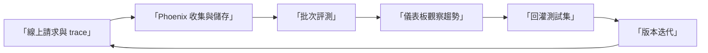
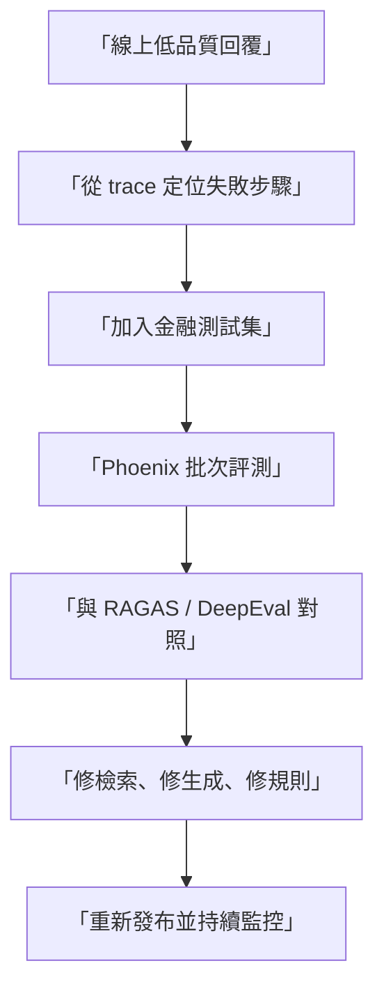

# Arize Phoenix 完整教學（深入版）

> 適用對象：需要「線上可觀測性 + 離線評測」一體化治理的團隊。

## 為什麼用 Phoenix

Phoenix 和另外兩個工具最大的差異是：它不只做評分，還把 trace、評分、錯誤分析放在同一個操作面。

你可以用它回答這些問題：

1. 哪個 pipeline step 最常導致低品質回答。
2. 哪些失敗案例在特定版本突然變多。
3. 線上流量與離線評測是否一致。

## 版本基準（截至 2026-02-08）

| 元件 | 建議版本 | 說明 |
|---|---:|---|
| `arize-phoenix` | `12.33.1` | 目前 PyPI 最新版 |
| `arize-phoenix-evals` | `2.9.0` | 目前 PyPI 最新版 |

## Phoenix 在整體治理中的位置

## 兩條能力線：Observability 與 Evaluation

| 能力線 | 你會得到什麼 | 適用時機 |
|---|---|---|
| Observability | trace、延遲、步驟級失敗定位 | 線上診斷與根因分析 |
| Evaluation | 批次分數與標籤 | 發版前驗收與週期回歸 |

## 你在專案裡應優先使用的能力

1. 先用 code evaluator 建立本地可重現的規則評測。
2. 再加入 LLM evaluator（如 hallucination、relevance）。
3. 最後把線上 traces 納入同一套評測節奏。

## 常用評測器應該怎麼看

| 評測器 | 主要用途 | 低分時先查哪裡 |
|---|---|---|
| HallucinationEvaluator | 檢查回答是否無根據 | 檢索內容覆蓋率、回答約束 |
| RelevanceEvaluator | 檢查檢索與問題相關性 | 檢索查詢改寫、rerank |
| QAEvaluator | 檢查回答品質 | 回答結構、資訊完整度 |
| 自訂 code evaluator | 將內規落地 | 規則定義是否可執行 |

## 與金融共用測試集的對接

Phoenix Notebook 與其他兩套工具共用：

- 文件：`/Benchmark-Governance/data/financial-stability-report-20211108.pdf`
- 問題集：`/Benchmark-Governance/data/finance-rag-benchmark.json`

這可直接比較同一份回答在三個框架中的評分差異。

## LangChain Tracing 整合（你提供的重點資源）

若你的 RAG pipeline 是 LangChain，建議優先完成 Phoenix tracing 整合，再進入評測。  
這樣你不只知道「分數低」，還能直接知道「哪個鏈路步驟造成低分」。

建議閱讀順序：

1. Phoenix 官方整合文件（LangChain tracing）  
<https://arize.com/docs/phoenix/integrations/python/langchain/langchain-tracing>
2. 官方 Colab 教學（LangChain tracing tutorial）  
<https://colab.research.google.com/github/Arize-ai/phoenix/blob/main/tutorials/tracing/langchain_tracing_tutorial.ipynb>

建議導入流程：

1. 先把 LangChain pipeline trace 成功送進 Phoenix。
2. 確認每個 step（檢索、重排、生成）都能在 trace 中被區分。
3. 將低分樣本對回 trace，做步驟級根因分析。
4. 依 trace 結論修正後，回到三工具共同 benchmark 重跑。

整合後你的收益：

1. 評分與根因不再分離，排障速度提升。
2. 能建立「線上異常 -> 離線重現 -> 修正驗證」閉環。
3. 可把 LangChain trace 直接納入團隊週期性品質審查。

## 實務上最容易踩的坑

1. 只建 dashboard，不做失敗案例閉環。
2. 評測規則沒有版本化，歷史趨勢不可解釋。
3. 把所有問題丟給 LLM evaluator，忽略可 deterministic 的 code rules。
4. 線上 trace 沒做抽樣策略，噪音太大。

## 流程圖：線上問題回灌機制

## 對應 Notebook

- `/Benchmark-Governance/notebooks/arize-phoenix-tutorial.ipynb`

## 官方資源

- Phoenix Docs: <https://arize.com/docs/phoenix>
- arize-phoenix PyPI: <https://pypi.org/project/arize-phoenix/>
- arize-phoenix-evals PyPI: <https://pypi.org/project/arize-phoenix-evals/>
