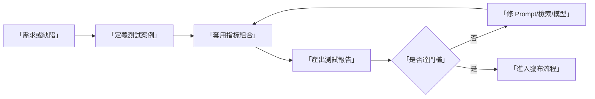
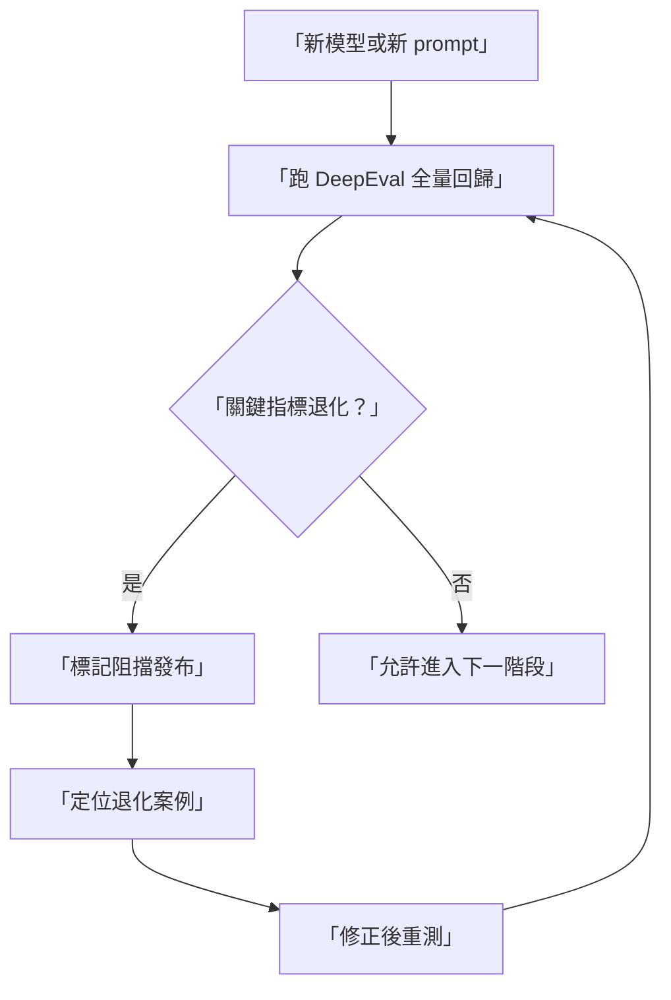

# DeepEval 完整教學（深入版）

> 適用對象：想把 LLM 評測正式納入工程流程（測試、回歸、CI）的團隊。

## 為什麼用 DeepEval

DeepEval 的優勢不是只在指標數量，而是它的工程化測試語意：

1. 把每個問題視為 test case。
2. 把品質規則視為可重複執行的 metric。
3. 把評測結果納入版本迭代與 CI 準入。

如果 RAGAS 偏向「RAG 體檢」，DeepEval 更像是「品質工程作業系統」。

## 版本基準（截至 2026-02-08）

| 元件 | 建議版本 | 說明 |
|---|---:|---|
| `deepeval` | `3.8.4` | 目前 PyPI 最新版 |
| 評審模型 | 固定單一版本 | 確保跨版本可比較 |

## DeepEval 在團隊工作流的位置

## 指標體系如何設計

建議把指標分成三層：

1. 基礎品質：Answer Relevancy、Faithfulness。
2. 風險品質：Hallucination、Toxicity、Bias。
3. 業務品質：GEval（自訂標準）。

這能避免只看單一分數導致誤判。

## 與 RAG 場景最相關的指標解讀

| 指標 | 管理目的 | 常見 fail 訊號 | 改善建議 |
|---|---|---|---|
| Answer Relevancy | 確保回答切題 | 回答偏題、重複、閃避 | 重寫系統指令與任務邊界 |
| Faithfulness | 降低憑空捏造 | 引用不存在事實 | 強化 grounding、限制自由發揮 |
| Contextual Precision | 提升檢索含金量 | 前位結果噪音高 | 改 retriever 與 reranker |
| Hallucination | 追蹤風險輸出 | 高風險敘述無證據 | 建立拒答與引用策略 |
| GEval | 反映企業標準 | 指標高但業務不可用 | 將業務規範轉成 rubric |

## 實戰導入步驟（無程式碼版）

1. 先定義最小可行測試集（10-30 題）。
2. 為每題建立期望輸出與必要上下文。
3. 定義「必過」和「可觀察」指標。
4. 設定各指標門檻與阻擋規則。
5. 產出每輪回歸報告並追蹤退化案例。

## 你專案中的金融共用測試集

DeepEval Notebook 已對齊以下共用資料：

- 文件：`/Benchmark-Governance/data/financial-stability-report-20211108.pdf`
- 問題集：`/Benchmark-Governance/data/finance-rag-benchmark.json`

這讓 DeepEval、RAGAS、Phoenix 的結果可以直接對照。

## GEval 在企業情境的最佳用途

GEval 適合處理「通用指標看不出，但業務很在意」的條件，例如：

1. 是否明確揭露不確定性。
2. 是否保持金融敘述保守性。
3. 是否避免過度推論政策含義。

## 常見失敗模式

1. 指標太多但沒有優先級。
2. 每輪都改資料與模型，無法判讀改動效果。
3. 只看 aggregate，不追失敗案例。
4. 把 GEval 當黑箱，沒有定義明確 rubric。

## 流程圖：回歸測試治理

## 對應 Notebook

- `/Benchmark-Governance/notebooks/deepeval-tutorial.ipynb`

## 官方資源

- DeepEval Docs: <https://docs.confident-ai.com/>
- DeepEval PyPI: <https://pypi.org/project/deepeval/>
