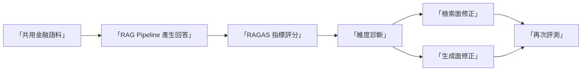
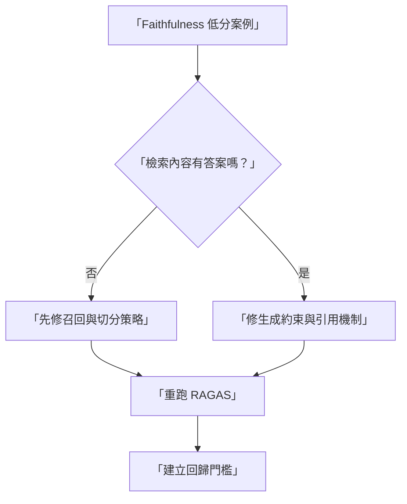

# RAGAS 完整教學（深入版）

> 適用對象：第一次導入 RAG 評測的新人工程師、需要把「檢索問題」與「生成問題」分開治理的團隊。

## 為什麼用 RAGAS

RAGAS 的核心價值不是「多一個分數」，而是把 RAG 失敗拆成可修復的子問題：

1. 檢索是否找對內容。
2. 回答是否忠於內容。
3. 回答是否切題。
4. 回答是否真的利用到檢索內容。

這種拆解非常適合你現在的 LLM 評測專案，因為可以直接對應到資料治理、prompt 優化與檢索策略優化。

## 版本基準（截至 2026-02-08）

| 元件 | 建議版本 | 說明 |
|---|---:|---|
| `ragas` | `0.4.3` | 目前 PyPI 最新版 |
| 評審模型 | 固定單一版本 | 建議溫度固定、避免分數漂移 |
| embeddings | 固定單一版本 | 避免跨次評測不可比 |

## RAGAS 在評測流程中的角色

## 你應該先理解的五個指標

| 指標 | 問題意義 | 高分代表 | 低分常見原因 | 優先修正方向 |
|---|---|---|---|---|
| Faithfulness | 回答是否忠於來源 | 回答幾乎都能在檢索內容找到依據 | 幻覺、過度推論 | 約束回答可引用範圍、加入引用檢查 |
| Answer Relevancy | 回答是否切題 | 回答覆蓋問題核心意圖 | 答非所問、過度冗長 | 重寫問題模板、加意圖分類 |
| Context Precision | 檢索排序是否精準 | 前段檢索多為高相關內容 | 高噪音 chunk 排在前面 | 調整檢索排序與 rerank |
| Context Recall | 檢索是否完整 | 回答所需關鍵資訊多被召回 | 召回不足、chunk 切分不佳 | 擴充召回、改善 chunk 策略 |
| Context Utilization | 回答是否有效使用上下文 | 回答明顯由檢索內容支撐 | 模型忽略檢索段落 | 強化 grounding 指令 |

## 實戰導入步驟（無程式碼版）

1. 定義共用資料集與問題集。
2. 以固定版 RAG pipeline 先跑一次 baseline。
3. 用 RAGAS 計算五個核心指標。
4. 先看低分案例，再看平均分。
5. 依指標類型分流修正：
檢索面：Context Precision/Recall。
生成面：Faithfulness/Relevancy/Utilization。
6. 每輪只改一到兩個變因，保留實驗紀錄。

## 與你目前金融樣本的對接

本專案已提供共用測試資料：

- 文件：`/Benchmark-Governance/data/financial-stability-report-20211108.pdf`
- 問題集：`/Benchmark-Governance/data/finance-rag-benchmark.json`

RAGAS Notebook 會直接讀這兩份資料，和 DeepEval/Phoenix 使用相同資料來源，方便橫向比較。

## 判讀結果時的常見誤區

1. 只看平均分，不看個案分布。
2. 一次改太多設定，無法定位改善來源。
3. 評審模型版本不固定，導致歷史分數不可比。
4. 把 RAGAS 當「最終裁決」，不做人類抽樣審查。

## 什麼時候優先用 RAGAS

- 你主要是做 RAG，且想要精準分離檢索與生成責任。
- 你有明確的知識庫來源，希望追蹤「引用忠實度」。
- 你要建立週期性回歸評測，避免上線後品質慢性退化。

## 流程圖：從低分到修正

## 對應 Notebook

- `/Benchmark-Governance/notebooks/ragas-tutorial.ipynb`

## 官方資源

- RAGAS Docs: <https://docs.ragas.io/>
- RAGAS PyPI: <https://pypi.org/project/ragas/>
